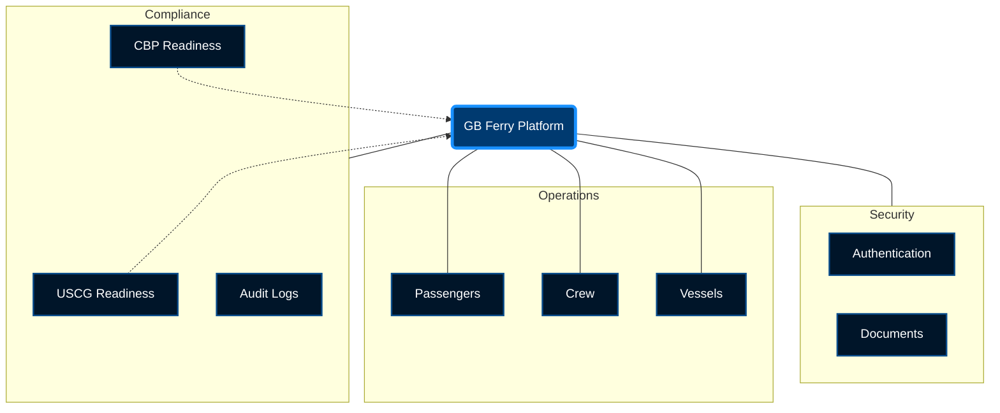

# GB Ferry Platform Overview

## Design & Brand Identity

This platform utilizes a **Maritime Tech** aesthetic, leveraging deep blues and glassmorphism to convey security and modern efficiency.

### Color Palette

- **Deep Ocean**: `#001529` (Backgrounds, Sidebar)
- **Mid Blue**: `#003a70` (Cards, Headers)
- **Highlight Blue**: `#1890ff` (Primary Buttons, Active States, Links)
- **Glass Effect**: `rgba(255, 255, 255, 0.15)` with `backdrop-filter: blur(10px)`

## System Modules

The platform is composed of several interconnected modules centered around core Operations and Compliance.

## Module Descriptions

| Module         | Description                              | Brand Color Usage                     |
| :------------- | :--------------------------------------- | :------------------------------------ |
| **Passengers** | Manifest management, check-in flows.     | White cards on Deep Ocean background. |
| **Crew**       | Crew lists, certifications, scheduling.  | Mid Blue headers.                     |
| **Compliance** | USCG/CBP readiness, NOAD/APIS pipelines. | Highlight Blue for status indicators. |
| **Vessels**    | Ship management, maintenance logs.       | Glassmorphism panels.                 |
