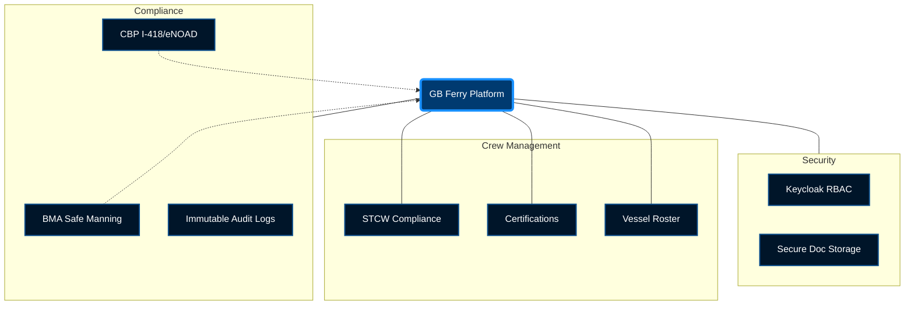

# GB Ferry Platform Overview

## Design & Brand Identity

This platform utilizes a **Maritime Tech** aesthetic, leveraging deep blues and glassmorphism to convey security and modern efficiency.

### Color Palette

- **Deep Ocean**: `#001529` (Backgrounds, Sidebar)
- **Mid Blue**: `#003a70` (Cards, Headers)
- **Highlight Blue**: `#1890ff` (Primary Buttons, Active States, Links)
- **Glass Effect**: `rgba(255, 255, 255, 0.15)` with `backdrop-filter: blur(10px)`

## System Modules

The platform is composed of several interconnected modules centered around Crew Compliance and Regulatory Reporting.

```mermaid
graph TD
    %% Styling
    classDef hub fill:#003a70,stroke:#1890ff,stroke-width:4px,color:white;
    classDef module fill:#001529,stroke:#0a4d8c,stroke-width:2px,color:white;
    classDef ext fill:#1890ff,stroke:#fff,stroke-width:1px,color:white;

    %% Nodes
    Core(GB Ferry Platform)

    subgraph "Crew Management"
        Crew[STCW Compliance]
        Cert[Certifications]
        Vessel[Vessel Roster]
    end

    subgraph Compliance
        BMA[BMA Safe Manning]
        CBP[CBP I-418/eNOAD]
        Audit[Immutable Audit Logs]
    end

    subgraph Security
        Auth[Keycloak RBAC]
        Docs[Secure Doc Storage]
    end

    %% Connections
    Core --- Crew
    Core --- Cert
    Core --- Vessel
    Core --- Compliance
    Core --- Security

    BMA -.-> Core
    CBP -.-> Core

    %% Apply Styles
    class Core hub;
    class Crew,Cert,Vessel,BMA,CBP,Audit,Auth,Docs module;
```

## Module Descriptions

| Module             | Description                                 | Brand Color Usage                     |
| :----------------- | :------------------------------------------ | :------------------------------------ |
| **Crew**           | STCW certificates, roles, and seafarer IDs. | Mid Blue headers.                     |
| **Certifications** | Automated expiry tracking and validation.   | Highlight Blue for status indicators. |
| **Compliance**     | BMA Safe Manning and US CBP reporting.      | Glassmorphism panels.                 |
| **Vessels**        | Fleet management and required manning.      | White cards on Deep Ocean background. |
