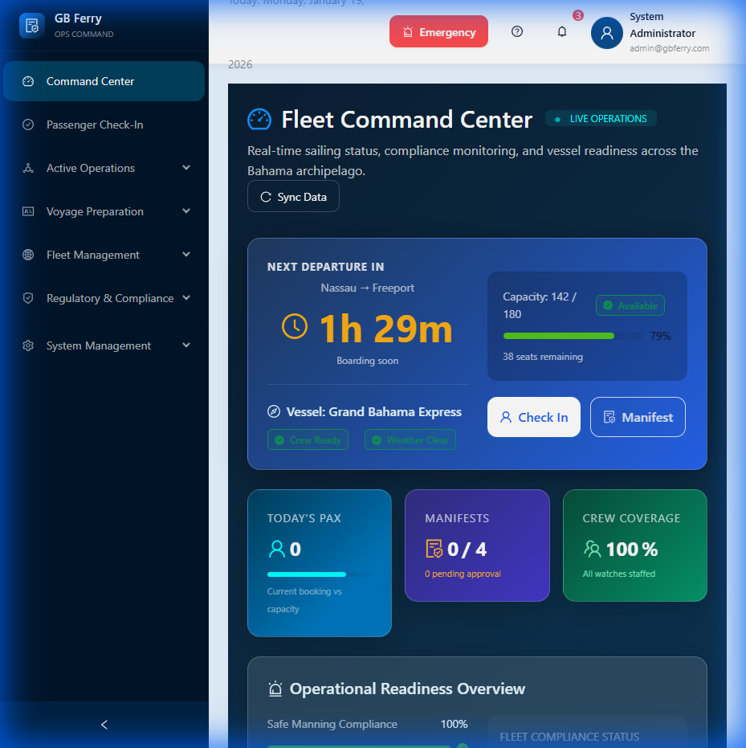
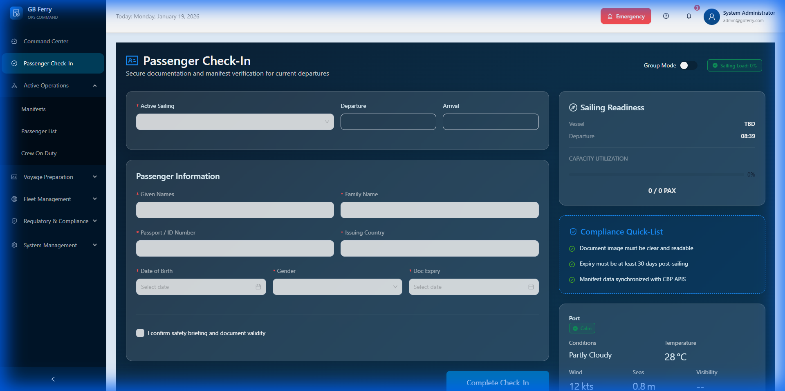
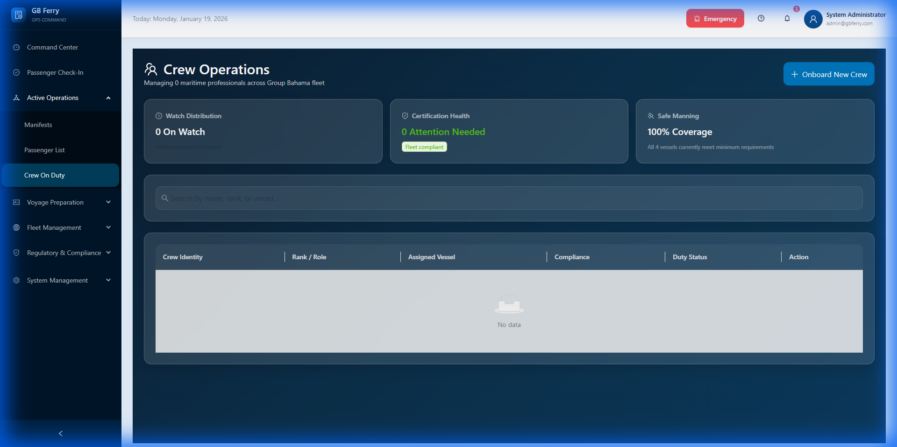
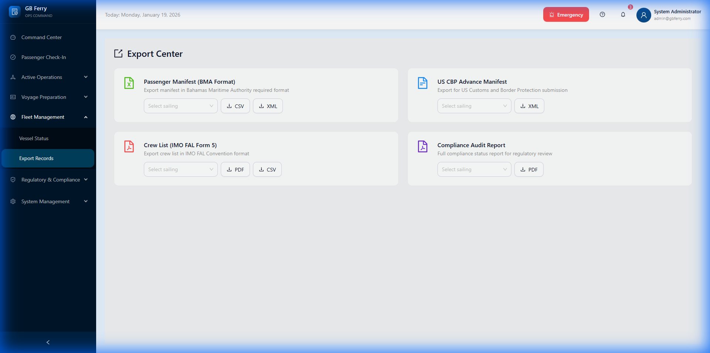

# GB Ferry Platform Visual Tour

This document provides a visual overview of the Grand Bahama Ferry Maritime Compliance Platform, highlighting the core modules and their functions.

---

## 🧭 Navigation Overview

The platform is organized into logically grouped modules accessible via the sidebar:

- **Command Center**: Real-time fleet overview.
- **Passenger Check-In**: Secure documentation and identity verification.
- **Fleet Management**: Registry and crew management.
- **Regulatory & Compliance**: Export center for manifest and audit data.

---

## 🚀 Key Pages

### 1. Fleet Command Center (Dashboard)

The central operational hub providing a "birds-eye view" of all maritime activities.

- **Function**: Monitors live operations, upcoming departures, and fleet-wide compliance health.
- **Key Features**: Sailing countdowns, vessel readiness indicators, and passenger booking trends.

### 2. Passenger Check-In

The primary interface for handling passenger terminal operations.

- **Function**: Securely captures passenger identity data and ensures compliance with maritime safety briefing requirements.
- **Key Features**: Real-time sailing readiness tracking, document validity verification, and passenger load monitoring.

### 3. Crew Operations (Crew Management)

The administrative center for maritime professionals.

- **Function**: Tracks crew certifications (STCW), watch distribution, and safe manning requirements.
- **Key Features**: "Watch Distribution" monitoring, certification health alerts, and onboard crew tracking.

### 4. Fleet Registry (Vessel Registry)

The digital registry for the entire vessel fleet.

- **Function**: Manages vessel registration data, technical specifications, and current status.
- **Key Features**: New vessel registration, technical document management, and status monitoring.

### 5. Export Center (Compliance & Reports)

The regulatory reporting engine of the platform.

- **Function**: Generates and exports official maritime documentation in required formats (CSV, XML, PDF).
- **Key Features**: BMA Passenger Manifests, US CBP Advance Manifests, IMO Crew Lists, and Compliance Audit Reports.

---

## 📦 How to Share

1. **As a Folder**: Share the entire `platform-tour` folder.
2. **As a ZIP**: Compress the `platform-tour` folder and send it.
3. **As a PDF**: Open this Markdown file in an editor (like VS Code or Obsidian) and use "Export to PDF".
