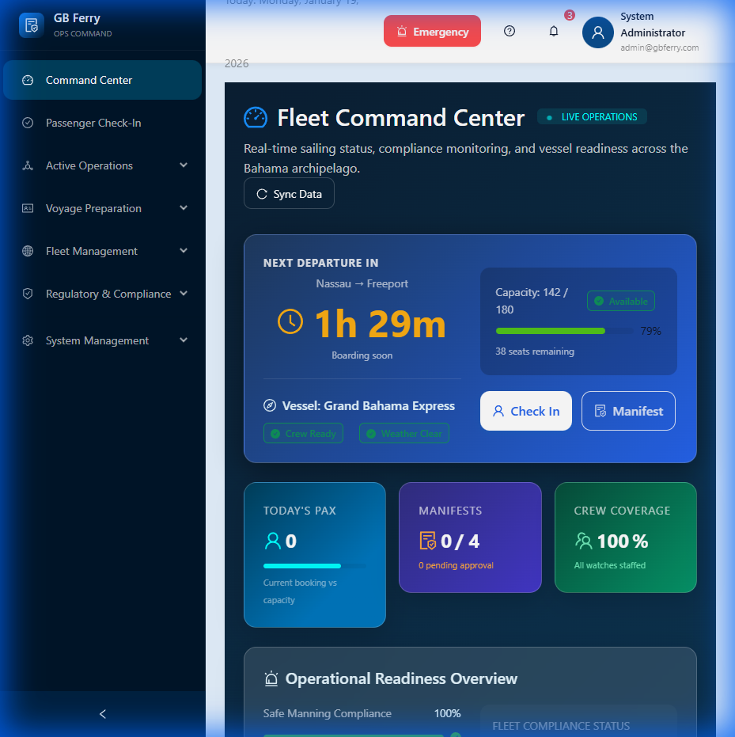
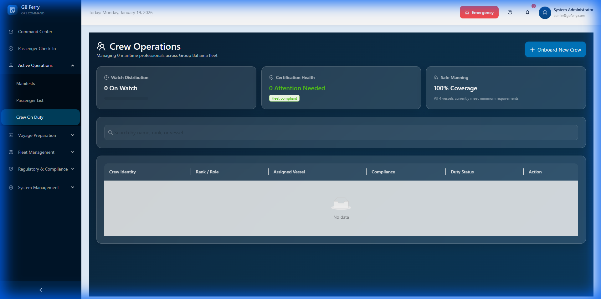
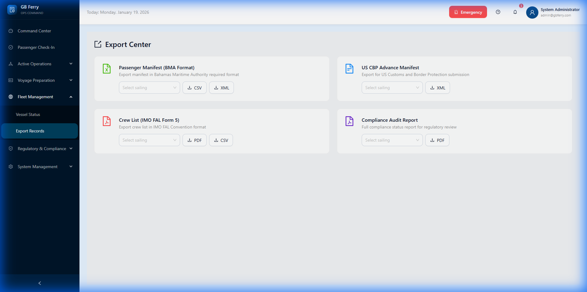
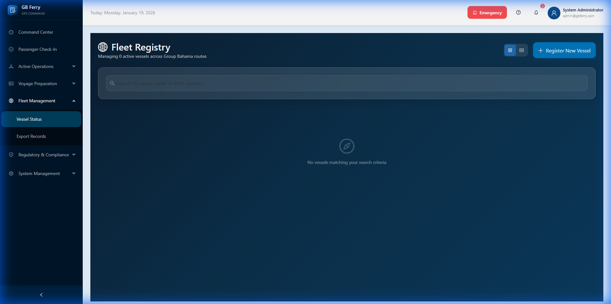

# GB Ferry Platform Visual Tour

This document provides a visual overview of the **Grand Bahama Ferry Maritime Compliance Platform**, highlighting the core modules and their regulatory functions.

---

## 🧭 Navigation Overview

The platform is organized into logically grouped modules focused on maritime regulatory oversight:

- **Command Center**: Real-time regulatory oversight and fleet-wide compliance health.
- **Crew Compliance**: Management of STCW certifications, medical certificates, and safe manning.
- **Regulatory Forms**: Dedicated interface for US CBP (I-418/eNOAD) and BMA reporting.
- **Fleet Management**: Vessel registry and technical documentation management.
- **Inspections & Audit**: PSC inspection readiness and immutable audit trail.

---

## 🚀 Key Modules

### 1. Compliance Command Center (Dashboard)

The central operational hub providing real-time visibility into maritime compliance.

- **Function**: Monitors fleet-wide readiness, STCW expiry trends, and BMA R106 safe manning levels.
- **Key Features**: Voyage readiness countdowns, live compliance alerts, and Port State Control (PSC) readiness metrics.

*(Note: Visuals updated to focus on Crew Manning and Regulatory Telemetry)*

### 2. Crew Operations & STCW Management

The administrative center for maritime professionals and certification compliance.

- **Function**: Tracks seafarer certifications (STCW 78/95), medical certificates, and watch distribution.
- **Key Features**: "Safe Manning" billet fulfillment, automated certification health alerts, and AI-driven document parsing.

### 3. Regulatory Export Center

The jurisdictional translation layer for official maritime reporting.

- **Function**: Generates and exports official documentation for the BMA, US CBP, and other Caribbean jurisdictions.
- **Key Features**: Functional CSV/JSON exports for Crew Compliance Packs, automated Form I-418 generation, and session-level export history.

### 4. Fleet Registry & Technical Documents

The digital registry for the entire vessel fleet and its mandatory documentation.

- **Function**: Manages vessel specifications (IMO, Gross Tonnage) and regulatory documents.
- **Key Features**: Safe Manning Document (R106) management, Document of Compliance tracking, and technical file repository.

### 5. Compliance Reports (PSC Readiness)

Advanced analytics for Port State Control and internal audit.

- **Function**: Analyzes historical deficiency trends and generates point-in-time compliance snapshots.
- **Key Features**: PSC Deficiency analysis by severity, Fleet Compliance Snapshot table, and date-range based historical reporting.

---

## 🔒 Security & Governance

The platform implements enterprise-grade security tailored for maritime data:
- **AES-256-GCM Encryption**: PII (Passport/Seafarer ID) is encrypted at rest and only decrypted during regulatory transmission.
- **ISO 27001 Audit Trail**: Every regulatory action, document access, and export is recorded in an immutable, append-only audit log.
- **Rules Engine**: A pure, dependency-free Compliance Rules Engine ensures all validations (BMA R106, STCW) are consistent and auditable.

---

## 📦 How to Share

1. **As a Folder**: Share the entire `platform-tour` folder including screenshots.
2. **As a PDF**: Open this Markdown file in an editor (like VS Code) and use "Export to PDF".
